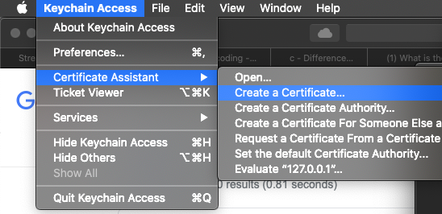
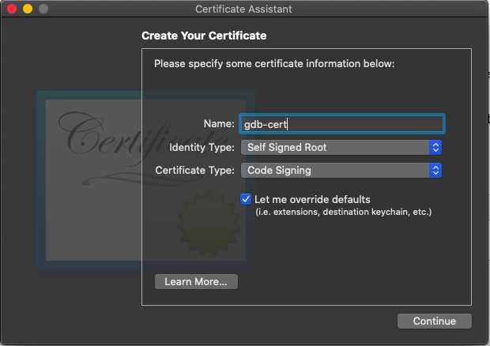
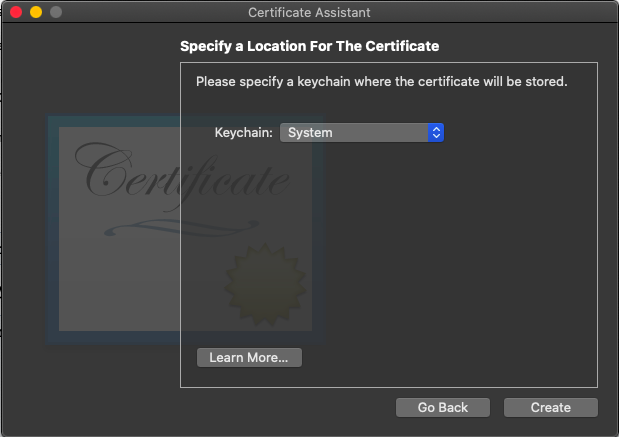
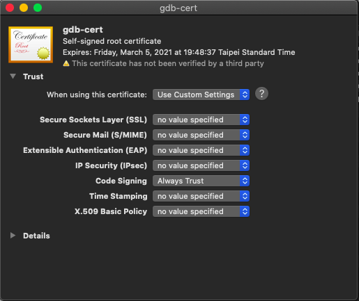

## Install gdb
```
$ brew install gdb
```

When running gdb, an error occured:
```
Unable to find Mach task port for process-id 45480: (os/kern) failure (0x5).
 (please check gdb is codesigned - see taskgated(8))
```

## Codesign gdb

1. Open `Keychain Access` application
    
    * use Spolight Search (⌘ + space) keyword

2. Open the menu item **Keychain Access > Certificate Assistant > Create a Certificate**
    
    

3. Create a certificate:

    * Name: gdb-cert
    * Identity Type: Self Signed Root
    * Certificate Type: Code Signing
    * enable `Let me override defaults`
    
    

4. Click several times on Continue until you get to the **Specify a Location** and set Keychain to **System**

    
    
5. In the terminal type following command line, and make sure that keychain is the `System.keychain`

    ```
    $ security find-certificate -c gdb-cert
    keychain: "/Library/Keychains/System.keychain"
    version: 256
    class: 0x80001000 
    attributes:
    "alis"<blob>="gdb-cert"
    "cenc"<uint32>=0x00000003 
    "ctyp"<uint32>=0x00000001 
    ...
    ```

6. Make sure that your certificate is not expired yet

    ```
    $ security find-certificate -p -c gdb-cert | openssl x509 -checkend 0
    Certificate will not expire
    ```
    
7. Trust the certificte for code signing

    * Open `Keychain Access` application
    * Find and open(double click) gdb-cert on the Category area
    * Open the Trust item, and set **Code Signing** to **Always Trust**
    
    
    
8. Create a gdb-entitlement.xml file containing the following

    ```
    <?xml version="1.0" encoding="UTF-8"?>
    <!DOCTYPE plist PUBLIC "-//Apple//DTD PLIST 1.0//EN" "http://www.apple.com/DTDs/PropertyList-1.0.dtd">
    <plist version="1.0">
    <dict>
      <key>com.apple.security.cs.debugger</key>
      <true/>
    </dict>
    </plist>
    </pre>
    ```
9.  In the terminal type

    ```
    $sudo codesign --entitlements gdb-entitlement.xml -fs gdb-cert $(which gdb)
    ```

10.  In the terminal type

    ```
    $ codesign -vv $(which gdb)
    /usr/local/bin/gdb: valid on disk
    /usr/local/bin/gdb: satisfies its Designated Requirement
    ```
    
11. Refresh th system's certifications and code-signing data

    ```
    $ sudo killall taskgated
    ```

12. Ensure that taskgated

    ```
    $ ps $(pgrep -f taskgated)
    PID   TT  STAT      TIME COMMAND
    47422   ??  Ss     0:00.01 /usr/libexec/taskgated
    ```

## Disable starting the debuggee (inferior) via a shell
echo "set startup-with-shell off" > .gdbinit 

---

## Reference

* https://sourceware.org/gdb/wiki/BuildingOnDarwin
* https://gist.github.com/hlissner/898b7dfc0a3b63824a70e15cd0180154